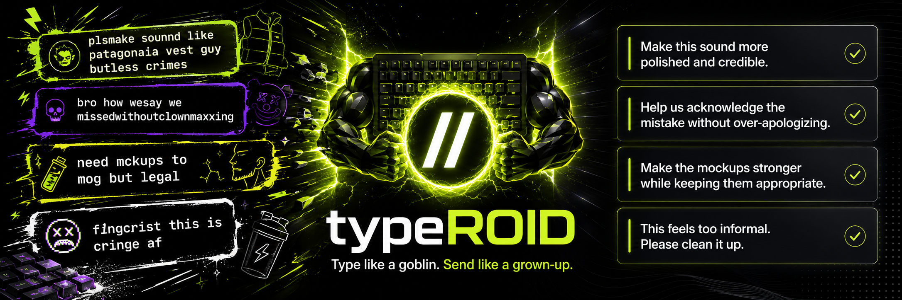

<p align="center">
  
</p>

<p align="center">
  <strong>Type like a goblin. Send like a grown-up.</strong>
</p>

<p align="center">
  Performance-enhancing drugs for your typing. Open source. No telemetry. No account. Just you and your AI.
</p>

---

## What is typeROID?

You already type like a caveman to ChatGPT and Claude. No caps, no grammar, pure brain dump. It works perfectly.

typeROID lets you do that with humans too. Type however you want in any app, hit a trigger, and your text gets fixed in place. No copy-paste. No switching apps. Just type and go.

## Triggers

| Trigger | What it does | Example |
|---------|-------------|---------|
| `//` | Fix your text | `heyy john cn u movee the mtg//` |
| blank-line `//` | Voice brief | Type `//`, talk, pause. If an app steals leading slash commands, type ` //` instead |
| `,,` | Voice brief | Reliable voice trigger for Slack, Codex, Terminal, iTerm2, Warp, and weird text fields |
| `??` | Ask AI anything | `whats 3pm EST in london??` |
| `;;` | Translate | `hello how are you doing;;` |
| `==` | Math & conversions | `15% of 340==` |
| `\\` | Summarize + reply | Copy a thread, type `\\`, get a summary and draft reply inline |
| `\|\|` | Rephrase | Paste canned/corporate text, hit `\|\|`, get it rewritten like a human said it |

## Voice brief mode

Voice brief mode is for raw thoughts you would rather say than type.

- Type `,,` anywhere typeROID is enabled, talk, then pause. This is the most reliable voice trigger, especially in native Slack and command-line apps.
- Type `//` on a blank line to start voice mode in normal text fields.
- Type ` //` when the host app opens a slash-command UI for leading `/`.
- Type `text //` to clean existing text. That does **not** start voice mode.

Voice audio is transcribed locally with Whisper when installed through Homebrew. After transcription, typeROID rewrites the transcript into a compact smart-brevity brief, deletes the trigger you typed, and pastes the result.

Voice brief mode records for up to about three minutes, or stops sooner after you pause for a couple seconds. It is designed for rambling, then compressing the ramble.

While recording, typeROID temporarily lowers your Mac's output volume so local audio is less likely to leak into the transcript. It restores the original volume as soon as recording stops.

For safety, typeROID does not activate in password fields, secure text fields, or browser address bars. Use it in the page or app text field instead.

## Install

### Homebrew (recommended)

```bash
brew install --cask chadwittman/typeroid/typeroid
```

### Update

```bash
brew reinstall --cask --force chadwittman/typeroid/typeroid
```

The Homebrew cask also installs `whisper-cpp` and downloads the local Whisper model used by voice brief mode.

### Manual

1. Download `typeROID.dmg` from [Releases](../../releases)
2. Open the DMG and drag `typeROID.app` to your Applications folder
3. Open it. Follow the onboarding.

After either method: grant Accessibility and Input Monitoring permissions when prompted, then paste your API key (OpenAI, Claude, Gemini, Groq, or run local models with Ollama).

## Build from source

```bash
git clone https://github.com/chadwittman/typeroid.git
cd typeroid
swift build -c release
bash scripts/install-dev-app.sh
```

Requires Xcode Command Line Tools and macOS 14+.

## Providers

typeROID works with any of these. Bring your own API key — or run fully local with Ollama.

| Provider | Default Model | Cost |
|----------|--------------|------|
| OpenAI | gpt-4.1-nano | ~$0.0001/message |
| Anthropic (Claude) | claude-haiku-4-5-20251001 | ~$0.001/message |
| Google (Gemini) | gemini-2.0-flash | Free tier available |
| Groq | llama-3.1-8b-instant | Free tier available |
| Ollama | any local model | Free — runs on your machine |

For Ollama: install [Ollama](https://ollama.com), pull a model (`ollama pull llama3`), then select Ollama in the typeROID menu. No API key needed. Nothing leaves your machine.

## Privacy & Security

typeROID is built for people who care about where their data goes.

- **No telemetry.** No analytics. No crash reporting. No network calls except your AI provider.
- **No database.** No account. No signup. Nothing stored on disk except your settings.
- **No logs.** Your text is never written to a file. It lives in memory during the API call, then it's gone.
- **API keys in Keychain.** Stored encrypted in macOS Keychain. Never logged or printed.
- **Sensitive data blocked.** SSNs, credit card numbers, passwords, and API keys are detected and blocked before they leave your machine.
- **Secure text fields blocked.** typeROID won't activate in password fields or browser address bars.
- **Small native core.** The app is Swift/AppKit. The Homebrew cask installs `whisper-cpp` and a tiny local model for voice transcription.
- **Fully open source.** Every line is auditable. Read [SECURITY.md](SECURITY.md) for the full breakdown.

> **Google Gemini note:** Google's API puts your API key in the URL. Your text is encrypted (HTTPS), but the key could be visible on public wifi or corporate VPNs with network inspection. OpenAI, Claude, and Groq send the key in fully encrypted headers. typeROID warns you when you select Google.

## Writing Style

Want typeROID to sound like you? Create `~/.typeroid/style.md` with examples of how you write. Enable it from the menu: Settings > Enable Writing Style.

```markdown
I keep it casual and direct. Short sentences.
I say "hey" not "hello". No corporate language.
```

## How it works

1. typeROID runs as a menu bar app (look for the `//` icon)
2. Monitors your keyboard for triggers (`//`, `,,`, `??`, `;;`, `==`, `\\`, `||`)
3. Captures text via macOS Accessibility API, or listens locally for voice brief mode
4. Sends text or the local transcript to your AI provider with a focused system prompt
5. Replaces your text in place, or deletes the voice trigger and pastes the brief

For `\\` summarize mode: copy a thread to your clipboard, then type `\\`. typeROID reads your clipboard as context, generates a summary and a draft reply, and drops both inline where you're typing — summary visible, reply loaded to your clipboard for ⌘V.

## Support

[@typeroid](https://twitter.com/typeroid) on X or [open an issue](../../issues).

## License

MIT
